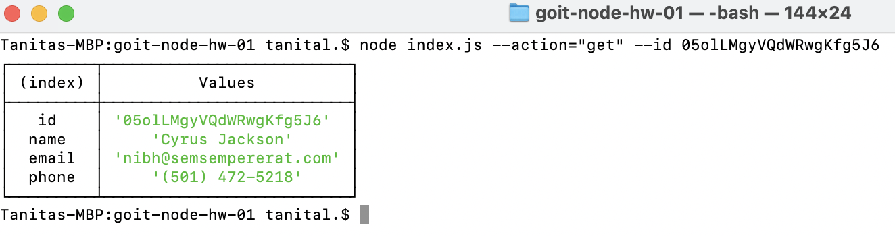
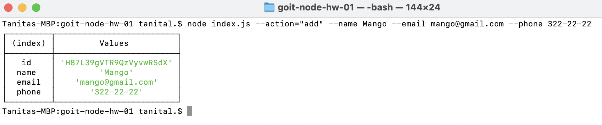
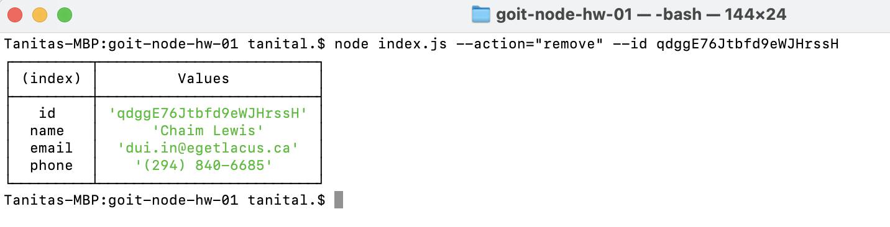

1. Отримуємо і виводимо весь список контактів у вигляді таблиці (console.table)
   node index.js --action="list"

2. Отримуємо контакт по id
   node index.js --action="get" --id 05olLMgyVQdWRwgKfg5J6

3. Додаємо контакт
   node index.js --action="add" --name Mango --email mango@gmail.com --phone 322-22-22

4. Видаляємо контакт
   node index.js --action="remove" --id qdggE76Jtbfd9eWJHrssH

